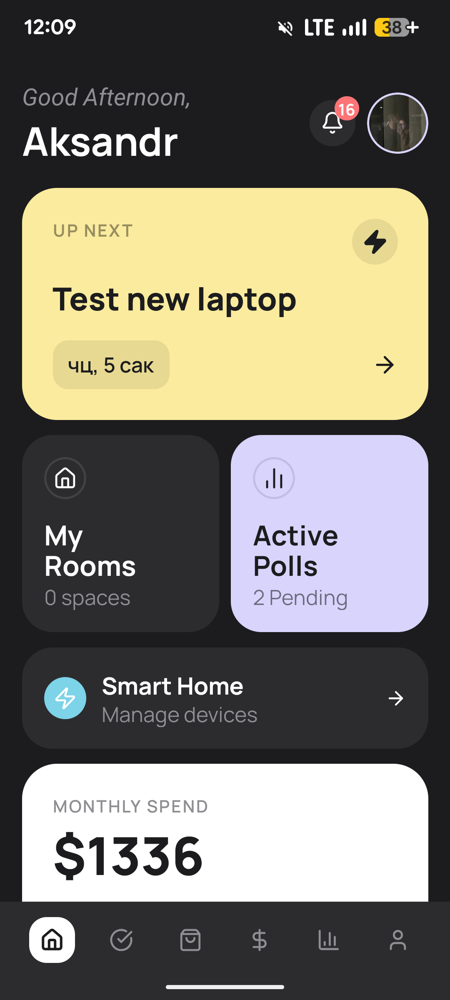
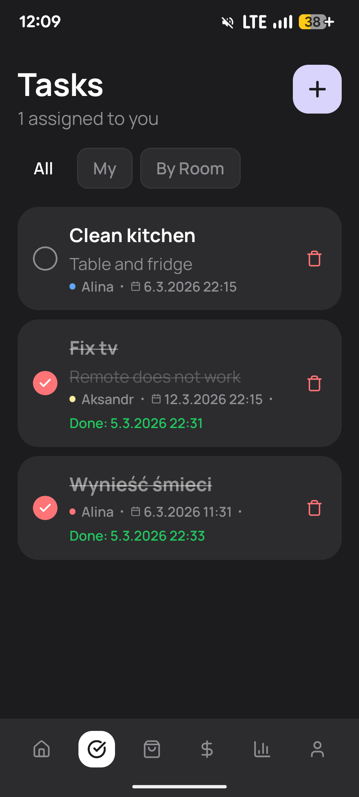
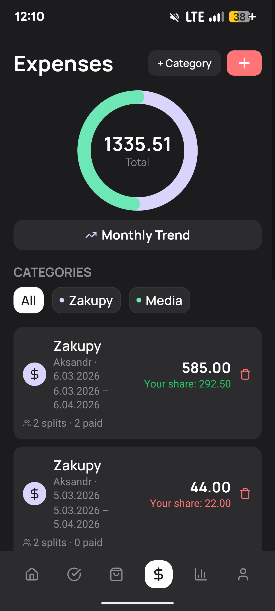
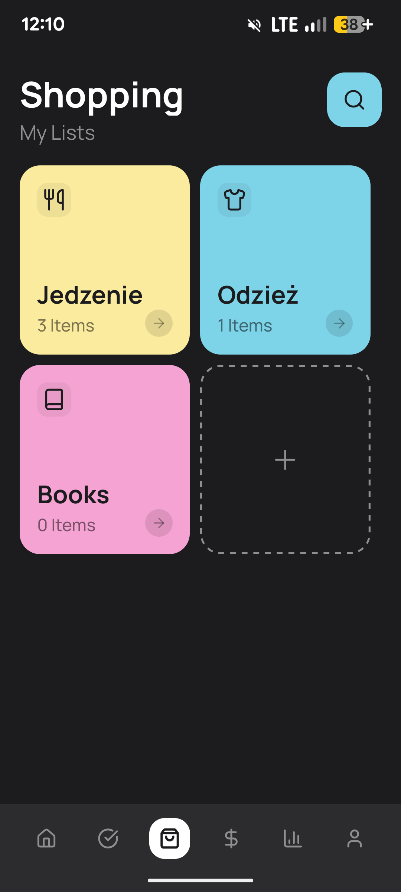
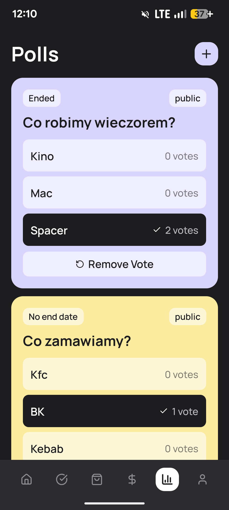
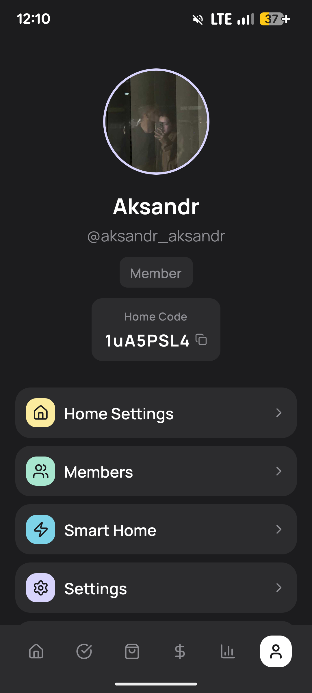

# Household Manager App

A cross-platform mobile application for managing shared households. Built with React Native (Expo) and a Go backend.

Members of a household can collaboratively manage tasks, bills, shopping lists, polls, smart home devices, and more — all in real time.

## Screenshots

<p align="center">
  
  
  
</p>
<p align="center">
  
  
  
</p>

## Features

- **Multi-Home Support** — create or join multiple households, switch between them freely
- **Task Management** — create tasks, assign to members, set due dates, track completion, recurring schedules with rotation
- **Bills & Budget** — track shared expenses, split bills between members, monthly spend charts (donut + bar)
- **Shopping Lists** — categorized lists with icons and colors, mark items as bought
- **Polls** — create votes for household decisions, anonymous voting support
- **Smart Home** — Home Assistant integration, discover and control devices per room
- **Notifications** — per-user and per-home notifications with real-time delivery
- **Real-time Updates** — WebSocket-powered live sync across all connected clients
- **Internationalization** — 8 languages: English, German, French, Italian, Polish, Ukrainian, Belarusian
- **Dark / Light / System Theme** — persisted preference with system auto-detection
- **Google OAuth** — sign in with Google alongside email/password auth

## Tech Stack

| Layer | Technology |
|---|---|
| Framework | Expo 54 / React Native 0.79 |
| Routing | Expo Router 5 (file-based) |
| State | Zustand 5 with subscribeWithSelector |
| Data Fetching | TanStack React Query 5, Axios |
| Styling | NativeWind (TailwindCSS 4 for RN) |
| Icons | Lucide React Native |
| Auth Storage | Expo Secure Store (encrypted) |
| Real-time | WebSocket with auto-reconnect |
| Backend | Go (Chi router, GORM, PostgreSQL, Redis) |

## Getting Started

### Prerequisites

- Node.js 18+
- Expo CLI (`npm install -g expo-cli`)
- iOS Simulator / Android Emulator / Physical device with Expo Go

### Installation

```bash
cd client
npm install
```

### Configuration

Copy `.env.example` to `.env` and set:

```env
EXPO_PUBLIC_API_URL=http://localhost:8000
EXPO_PUBLIC_GOOGLE_CLIENT_ID=your_google_web_client_id
EXPO_PUBLIC_GOOGLE_ANDROID_CLIENT_ID=your_google_android_client_id
EXPO_PUBLIC_GOOGLE_IOS_CLIENT_ID=your_google_ios_client_id
```

### Running

```bash
# Start Expo dev server
npm start

# Platform-specific
npm run android
npm run ios
npm run web

# Tunnel mode (for physical devices on different network)
npm run tunnel
```

## Project Structure

```
client/
├── app/                    # Expo Router pages (file-based routing)
│   ├── (tabs)/             # Bottom tab screens
│   │   ├── home.tsx        # Dashboard with task, poll, budget widgets
│   │   ├── tasks.tsx       # Task list, create, schedule rotation
│   │   ├── shopping.tsx    # Shopping categories and items
│   │   ├── budget.tsx      # Bills, splits, charts
│   │   ├── polls.tsx       # Polls and voting
│   │   └── profile.tsx     # User profile and home management
│   ├── rooms/              # Room management screens
│   ├── smarthome/          # Home Assistant device control
│   ├── login.tsx           # Email/password + Google login
│   ├── register.tsx        # Registration with email verification
│   ├── settings.tsx        # App settings
│   ├── members.tsx         # Home members, roles, invites
│   └── notifications.tsx   # Notification center
│
├── components/
│   ├── ui/                 # Reusable components (Button, Input, Modal, Card, etc.)
│   └── skeletons/          # Loading skeleton screens
│
├── stores/                 # Zustand state stores
│   ├── authStore.ts        # Authentication, JWT, user profile
│   ├── homeStore.ts        # Current home, rooms, membership
│   ├── themeStore.ts       # Dark/light/system theme
│   └── i18nStore.ts        # Language selection (8 languages)
│
├── lib/
│   ├── api.ts              # Axios client with all API endpoints
│   ├── websocket.ts        # WebSocket manager with auto-reconnect
│   ├── secureStorage.ts    # Encrypted token storage wrapper
│   ├── caseConverter.ts    # snake_case <-> camelCase bridge
│   ├── useRealtimeRefresh.ts  # Hook for WS-driven data refresh
│   ├── useGoogleAuth.ts    # Google OAuth hook
│   └── i18n/               # Translation files
│
├── constants/
│   ├── colors.ts           # Theme color palettes
│   └── fonts.ts            # Font family definitions
│
└── assets/
    ├── images/             # App icons, splash screen
    └── ui/                 # UI screenshots
```

## Available Scripts

| Command | Description |
|---|---|
| `npm start` | Start Expo dev server |
| `npm run android` | Run on Android |
| `npm run ios` | Run on iOS |
| `npm run web` | Run on web |
| `npm run tunnel` | Start with ngrok tunnel |
| `npm run lint` | Check code with Biome |
| `npm run lint:fix` | Auto-fix lint issues |
| `npm run format` | Format code with Biome |

## Architecture Notes

**Authentication flow:** JWT tokens are stored in Expo Secure Store (hardware-backed encryption on iOS/Android). Axios interceptors automatically attach the token to every request and handle 401 responses.

**Real-time sync:** A singleton `WebSocketManager` subscribes to auth state changes, connects/disconnects automatically on login/logout, and dispatches events by module (TASK, BILL, POLL, etc.) to subscribed components via `useRealtimeRefresh` hook.

**Case conversion:** The Go backend uses `snake_case` and the React Native client uses `camelCase`. Axios interceptors automatically convert request bodies/params and response data in both directions.

**Multi-tenancy:** All data-fetching operations are scoped to the currently selected home via `homeStore.currentHomeId`. Users can belong to multiple homes and switch between them.
